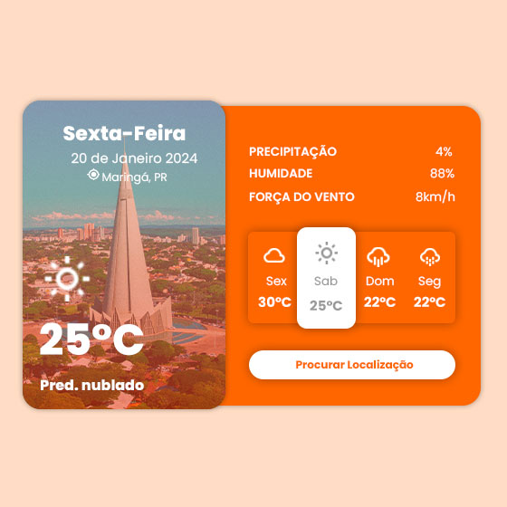

# App de Clima Personalizado

Este é o meu projeto de aplicativo de clima, inspirado no tutorial disponível no YouTube ([Link para o Tutorial](https://youtu.be/qC_DtdhH-J4)). Durante o desenvolvimento, explorei conceitos modernos de HTML e CSS para criar uma interface de usuário (UI) atraente, incorporando animações e efeitos visuais.

## Captura de Tela

Incluí uma captura de tela do projeto para dar uma visão rápida:

## Recursos e Tecnologias Destacadas

- HTML
- CSS
  - Transições CSS
  - Flexbox
  - Float
  - Animações CSS

